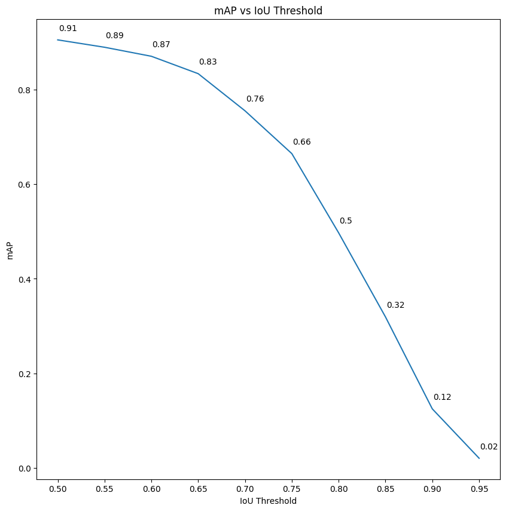

# Traffic Light and Crosswalk Detection with MobileNetv2 SSD

This repository contains code and models for detecting traffic lights and crosswalks using MobileNetv2 SSD (Single Shot MultiBox Detector). 

## Prerequisites
Make sure you have the following dependencies installed:
* Python (3.6 or higher)
* TensorFlow (2.8)
* Roboflow
 

## Dataset Information
The dataset used for training and testing traffic lights and crosswalks detection model consists of 3,793 images.

| Class                  	| Count 	|
|------------------------	|-------	|
| Traffic Light (Red)    	| 1182  	|
| Traffic Light (Green)  	| 1138  	|
| Traffic Light (Yellow) 	| 827   	|
| Crosswalk              	| 1266  	|
| Null Examples            	| 241  	    |

[Download](https://universe.roboflow.com/shipdataset/blind-cross-street-helper)

## 

## Model Evaluation
The trained traffic light and crosswalk detection models were evaluated using the following configuration:

| Model        | Batch Size | Epochs | mAP@50% |
|--------------|------------|--------|---------|
| ssd-mobilenet-v2-fpnlite-320 | 16          | 45000     | 90,56%    |

- **Model**: MobileNetv2 SSD (Single Shot MultiBox Detector) was used for object detection.
- **Batch Size**: The batch size during training and evaluation was set to 16.
- **Epochs**: The models were trained for 45000 epochs.
- **mAP@50%**: The mean Average Precision (mAP) was calculated at the intersection over union (IoU) threshold of 50%.

The average mAP across different intersection over union for the trained models is 58,82%. The mAP is a metric that measures the accuracy of object detection models.

### Loss Graph

### mAP Graph

## Testing Result
The following images show the result of traffic light and crosswalk detection.

| Red       | Yellow    | Green    | Crosswalk    |
|-----------|-----------|----------|--------------|
| .png)| .png)| .png)| .png)|
| .png)| .png)| .png)| .png)|
